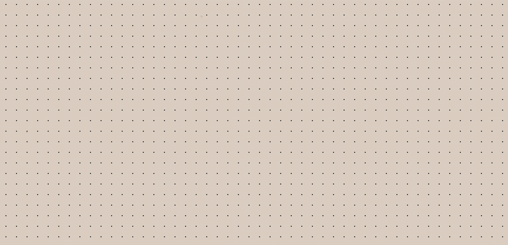
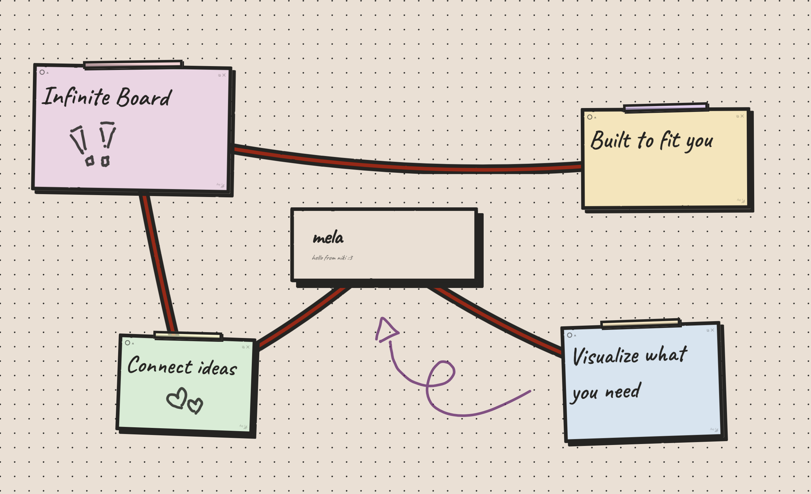
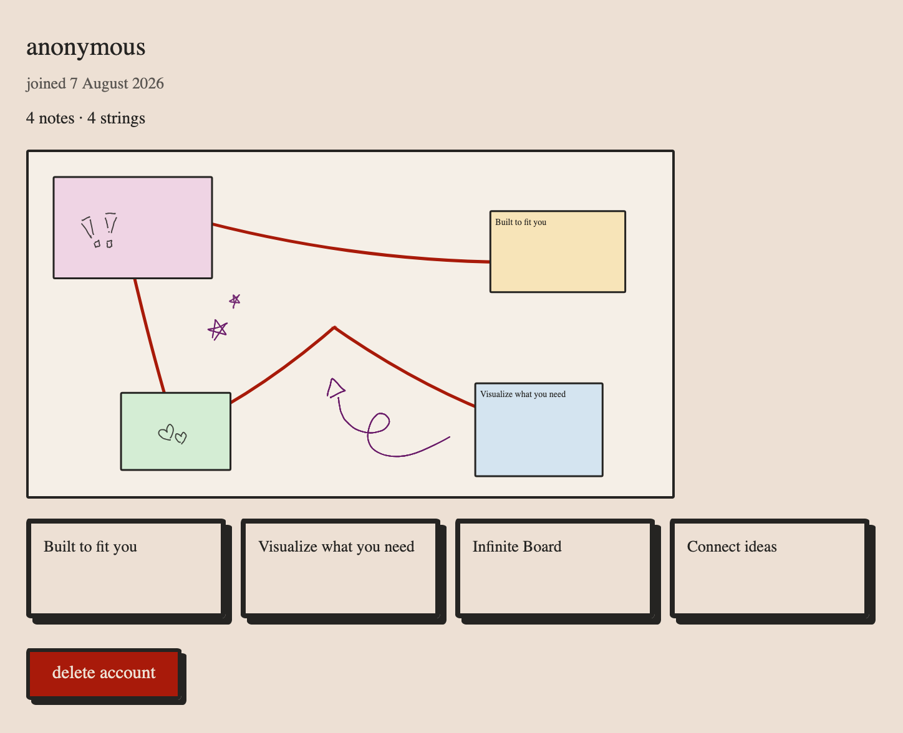

# mela

A corkboard style mood board and note taking platform. drag notes around, resize them, connect them with strings and doodle, all on an infinite board.

**Live:** [mela.nikimaisuradze.dev](https://mela.nikimaisuradze.dev)



## what it does

- add notes anywhere on an infinite canvas, drag and resize them freely
- connect notes with hand drawn strings, label them, change their color and style
- freehand drawing inside notes and on the canvas itself
- pick from a handful of note colors and shapes
- search across your notes with cmd + f
- an in app tutorial that plays out live on first visit, showing off the core features before you make an account
- accounts are anonymous, a generated id is the only login you need, no email required
- a small admin panel to look at what people have made

## screenshots




## tech stack

- **frontend:** next.js, react, typescript, tailwind
- **backend:** spring boot, java 21, spring security
- **database:** postgresql (h2 for local dev)
- **hosting:** fly.io

## running it locally

you'll need java 21, node 20+, and either docker or a local postgres/h2 setup.

with docker:

```bash
docker compose up
```

frontend will be on `localhost:3000`, backend on `localhost:8080`.

without docker, run each side separately:

```bash
# backend
cd backend
mvn spring-boot:run

# frontend
cd frontend
npm install
npm run dev
```

## project structure

```
backend/    spring boot api, postgres/h2, session based auth
frontend/   next.js app, canvas rendering, admin panel
```
